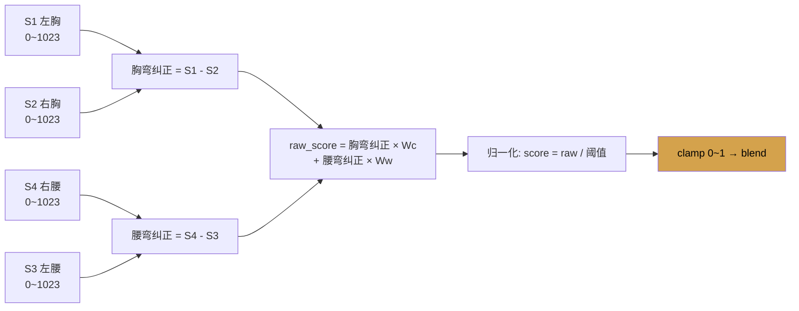

# ① 待机与准备阶段 —— 详细设计方案

> **这是体验的第一步**：用户走进展区 → 看展板 → （可选）扫码上传 X 光片 → 穿上智能背心 → 拿起手持按钮 → 自己按下启动。
>
> 本文档集中了所有**硬件相关内容**——传感器方案、blend 计算公式、马达策略、背心设计、手持按钮选型。这些是整个装置的物理基础，后续的引导动画和呼吸体验都依赖这里定义的数据流。

---

## 1. 环节定位

用户走进展区看到待机画面 → 可选用手机扫投影上的二维码上传 X 光片 → 穿上智能背心 → 拿起手持按钮 → **自己按下按钮**启动体验。约 1~1.5 分钟。

设计者在现场半辅助——帮用户调整背心松紧和传感器位置。

> **核心变更（v3 定稿）**：取消 iPad，改为手机扫码上传（可选）+ 手持按钮启动。**启动方式：用户自己按下手持按钮**，不做传感器自动就绪检测。

---

## 2. 用户动线

```
❶ 走进来看展板
    ↓
❷ 手机扫投影右下角 QR 码 → 上传 X 光片（建议先传！）
    ├── 有 X 光片 → 拍照/选图 → 上传 → AI 后台提取坐标（3-8秒）
    │   → 手机显示「✓ 已上传，请穿背心后按开始按钮」
    └── 不传也行，直接下一步
    ↓
❸ 穿上背心（设计者协助调整）
    ↓
❹ 拿起手持按钮，找个舒服的位置站好
    ↓
❺ 用户自己按一下按钮
    ↓
❻ → 进入认知引导动画（同时系统开始采集静息基线）
```

### 2.1 关键设计决策

- **不做传感器自动就绪检测**。穿戴到位后由**用户自己**按手持按钮，简单可靠
- 点「开始」的那一刻，系统开始采集观众自然呼吸数据作为基线（用于后续归一化）
- 按钮**手持式**——用户穿上背心后拿在手里，站好后直接按，不需要来回走动

---

## 2.5 IDLE 待机画面（投影显示内容）

> **这是用户走进展区时第一眼看到的东西。** 在用户按下手持按钮之前，投影一直显示这个画面。
>
> 硬件准备（扫码上传、穿背心、拿按钮）的动线见 §2，手持按钮详情见 §3。本节只描述**屏幕上显示什么**。

### 画面构成

| 层 | 内容 | 技术实现 | 说明 |
|---|------|---------|------|
| 底层（Layer 0） | 散乱缓慢漂浮的粒子场 | Three.js Points + ShaderMaterial | 没有脊柱形态，纯随机分布 |
| 中层（Layer 1） | 作品名称大字（居中偏上） | HTML/CSS 叠加层 | 占位文字，后续定稿时替换 |
| 前层（Layer 2） | 上传 QR 码 + 提示文字 | HTML/CSS 叠加层 | 固定在右下角 |

### 2.5.1 粒子场规格

- **密度**：低（约为体验主体粒子数的 1/3 ~ 1/4）。待机不需要视觉冲击力
- **运动**：极慢随机漂移，类似屏保效果。没有方向性、没有聚集趋势
- **颜色**：冷调蓝紫灰，低饱和度、低亮度（"还没醒过来"的感觉）
- **大小**：粒子尺寸偏小且不均匀，营造"尘埃/星点"感而非"实体"感

> **设计意图**：IDLE 的粒子就是引导动画第一段的"原材料"。用户按下按钮后，这些散粒子会向脊柱曲线位置凝聚——**同一个 Three.js 场景，不切换、不重建**。

### 2.5.2 UI 元素

#### 作品名称

- **位置**：屏幕垂直居中偏上约 30%~35% 处，水平居中
- **内容**：`【作品名称】`（占位，待定）
- **样式**：浅色文字（白色或淡蓝紫），字号较大但不夸张，字重细/中等（light/regular），低透明度 (~0.6~0.7)
- **效果**：可有极缓慢的呼吸式透明度变化（opacity ±0.1，周期 ~4s），暗示"这是活的"

#### QR 码区域

- **位置**：屏幕右下角，距边缘约 3%~5%
- **QR 码尺寸**：约屏幕短边的 8%~10%（足够手机在 1~2 米外扫到）
- **提示文字**：`扫码上传 X 光片（可选）`
  - 字号小，放在 QR 码上方或左侧
  - 低亮度灰白色，不抢注意力
- **注意**：每轮体验结束后 reset 会刷新 QR 码（新 session_id），所以 IDLE 的码是动态更新的

### 2.5.3 音频

- **有极低音量的环境背景音**（音量 ~0.1~0.2），持续播放
- 目的：不完全静默避免"死机错觉"，同时不干扰展区的整体氛围
- 用户按下按钮后，环境音平滑过渡到引导动画的音频（渐强 + 可能变调）

---

## 3. 手持按钮方案

### 3.1 为什么用手持按钮

固定安装在展台上的按钮需要用户穿好背心后再走过去按——多一次走动。手持按钮让用户穿好背心后**拿在手里、找好位置、直接按下**，一步到位。同时也有一种"交到你手里了，你来掌控"的仪式感。

### 3.2 硬件选型

推荐使用 USB 即插即用的 Arcade 按钮模块：

| 特性 | 说明 |
|------|------|
| 接口 | USB，插电脑即识别为键盘按键（HID） |
| 外观 | 迷你蘑菇头按钮，直径约 20-30mm（一手可握，轻便） |
| 反馈 | 按压有明显机械手感 + 可选内置 LED（呼吸灯效果） |
| 价格 | ¥30-80 |
| 品牌 | Adafruit Arcade Button（小号/迷你款）/ 国产兼容款 |
| 备选无线方案 | 蓝牙或 2.4G 无线按钮（¥50-150，省一根线但增加配对和断连风险，**展览场景优先选有线**） |

### 3.3 技术实现

按钮被按下时，USB Arcade Button 被电脑识别为键盘按键事件（HID），Flask 后端捕获该按键并发出 `START_GUIDE` 事件：
```
按钮按下 → USB HID 键盘事件 → Flask 捕获 → SocketIO → 前端进入 GUIDE 状态
```
同时：
1. 读取 session 数据——有 X 光就用真实数据，没有加载默认数据
2. 开始采集传感器基线数据

### 3.4 按钮有效性规则

**按钮仅在 IDLE 待机和 SHOWING 扫码带走两个阶段有效。**

| 阶段 | 按钮状态 | 说明 |
|------|---------|------|
| **IDLE 待机** | ✅ 有效 | 按下 → 开始体验 |
| **GUIDE 引导** | ❌ 忽略 | 正在播引导动画 |
| **EXPERIENCE 体验** | ❌ 忽略 | 正在进行呼吸体验 |
| **TRANSITION 过渡** | ❌ 忽略 | AI 正在生成艺术图 |
| **SHOWING 扫码带走** | ✅ 有效 | 海报+QR码常驻，用户扫码后按按钮→重置回 IDLE |

> **误触不是问题**——即使体验过程中不小心碰到按钮也不会有任何反应。

---

## 4. 手机上传页面设计

### 4.1 触达方式

投影画面右下角显示一个 QR 码，旁边有极简提示文字「扫码上传 X 光片（可选）」。QR 码链接到 Flask 服务提供的公网上传页面（通过 ngrok/Cloudflare Tunnel 暴露）。

### 4.2 手机端页面流程

```
┌──────────────────────┐
│                      │
│      📷 上传 X 光片   │
│                      │
│   ┌──────────────┐   │
│   │              │   │
│   │  + 点击拍照或 │   │
│   │    选择相册   │   │
│   │              │   │
│   └──────────────┘   │
│                      │
│       [ 上传 ]        │
│                      │
│   仅用于本次体验分析   │
│   图片不会存储        │
│                      │
└──────────────────────┘
```

**步骤分解：**

| 步骤 | 用户操作 | 系统响应 |
|------|---------|---------|
| 1 | 扫描投影上 QR 码 | 手机浏览器打开上传页面（竖屏适配） |
| 2 | 点中间区域 | 调起系统相机 / 相册选择器 |
| 3 | 选中一张图 | 页面显示预览缩略图，「上传」按钮变为可点 |
| 4 | 点「上传」 | 显示"上传中..." + 进度条；图片通过公网隧道发送到 Flask 服务端；服务端调 Gemini API 提取脊柱坐标；约 3-8 秒 |
| 5a | 上传成功 | 页面显示：「✓ 上传成功，请穿背心后按开始按钮」 |
| 5b | 上传失败（网络/格式错误） | 页面显示：「✗ 上传失败，请检查网络后重试」+ [重新上传] 按钮 |
| 5c | 上传成功但无法识别为 X 光片 | 页面显示：「⚠ 无法识别为脊柱 X 光片，请重新上传清晰的正位/侧位 X 光片」+ [重新上传] 按钮。不重试的话体验时走默认数据，但**必须明确告知用户** |

### 4.3 手机端不做什么

- ❌ 不显示脊柱弯曲类型
- ❌ 不显示 Cobb 角度数值
- ❌ 不显示任何分析结果（这些全部在投影大屏的引导阶段展示）
- ❌ 不显示呼吸引导或其他体验内容

### 4.4 边界情况

| 情况 | 处理方式 |
|------|---------|
| 多个人扫同一个码传不同的 X 光？ | 以最后一次上传为准（覆盖写入）。实际场景不太可能发生——排队体验，一次一人 |
| 想换一张 X 光？ | 重新扫码（同一个 QR 码）再传一次，新图覆盖旧的 |
| 扫码后页面打不开？（网络问题） | 显示网络错误提示可重试；不影响主流程——跳过上传直接按按钮也能体验 |
| 上传了一张不是 X 光的照片？ | **手机端明确提示**「⚠ 无法识别为脊柱X光片，请上传清晰的脊柱正位/侧位X光片」，提供 [重新上传] 按钮。**不允许静默走默认**——用户以为传成功了，结果看到的是假数据，体验反而更差。如果用户不重试直接去按按钮 → 体验时走默认脊柱逻辑（但手机端已经告知过用户了） |
| 一轮结束后有人扫旧 QR 码？ | session_id 已失效，页面提示"该会话已结束，请扫描大屏上的最新二维码" |

---

## 5. 传感器方案设计

### 5.1 施罗斯呼吸法原理分析

施罗斯（Schroth）呼吸法的核心：

```
你的侧弯类型：S 型
  ├── 胸椎右凸（主弯）→ 右侧胸廓凸出，左侧塌陷
  └── 腰椎左凸（代偿）→ 左侧腰部凸出，右侧塌陷

施罗斯目标：
  ├── 向左侧胸廓吸气 → 撑开塌陷的左胸 → 纠正胸弯
  └── 向右侧腰部吸气 → 撑开塌陷的右腰 → 纠正腰弯

检测逻辑：
  如果用户做对了 → 塌陷侧膨胀 → 对应传感器压力增大
  如果没做对 → 凸侧继续膨胀 → 凸侧传感器压力增大，塌陷侧无变化
```

### 5.2 传感器布局：4 片方案（最终定稿）

> **统一说明：本装置使用 4 片 FSR402 传感器（S1-S4），分别位于左右胸廓和左右腰部。不使用第 5 片腹部传感器。**
> Arduino 代码、接线图、采购清单均以 4 片为准。

```
            ┌──────────────────────┐
            │       背心背面        │
            │    （穿戴者背部）      │
            │                      │
            │   左侧        右侧   │
            │                      │
            │  ┌─[S1]─┐  ┌─[S2]─┐ │  ← 胸廓位置（T6-T8 高度，约肩胛骨下缘）
            │  │ 左胸  │  │ 右胸  │ │
            │  │(塌陷侧)│  │(凸侧) │ │
            │  └───────┘  └───────┘ │
            │                      │
            │  ┌─[S3]─┐  ┌─[S4]─┐ │  ← 腰部位置（L2-L4 高度，约腰线）
            │  │ 左腰  │  │ 右腰  │ │
            │  │(凸侧) │  │(塌陷侧)│ │
            │  └───────┘  └───────┘ │
            │                      │
            └──────────────────────┘
```

| 传感器 | 位置 | 监测目标 | 呼吸做对时的变化 |
|--------|------|---------|----------------|
| **S1 左胸** | 左侧胸廓，肩胛骨下缘高度 | 胸弯塌陷侧膨胀 | **压力显著增大** ✓ |
| **S2 右胸** | 右侧胸廓，肩胛骨下缘高度 | 胸弯凸侧（对比参照） | 压力轻微变化 |
| **S3 左腰** | 左侧腰部，腰线高度 | 腰弯凸侧（对比参照） | 压力轻微变化 |
| **S4 右腰** | 右侧腰部，腰线高度 | 腰弯塌陷侧膨胀 | **压力显著增大** ✓ |

### 5.3 blend 参数计算（唯一权威定义）

4 个传感器的数据融合成一个 0~1 的 blend 值：



```
核心逻辑：
  胸弯纠正程度 = S1（左胸/塌陷侧） - S2（右胸/凸侧）
  腰弯纠正程度 = S4（右腰/塌陷侧） - S3（左腰/凸侧）

  差值为正 → 说明在向正确方向呼吸
  差值为零/负 → 没做对 或 普通呼吸

  blend = clamp( (胸弯纠正 × Wc + 腰弯纠正 × Ww) / 阈值, 0, 1 )

  默认权重：Wc = 0.6, Ww = 0.4（胸弯是主弯，权重更高）
  权重可根据用户弯型动态调整（见 §5.4）
  阈值需要现场调试，根据传感器灵敏度确定
```

**为什么要做差值，不直接读绝对值？**
- 普通呼吸时左右两侧都会膨胀，绝对值都增大
- 只有施罗斯定向呼吸时，塌陷侧膨胀**明显大于**凸侧
- 差值才能区分"普通呼吸"和"正确的施罗斯呼吸"

### 5.4 不同弯型的自适应（权重动态调整）

> **blend 公式中的权重不是写死的，会根据用户的脊柱类型自动调整。**
>
> 这是本装置支持"个性化体验"的核心机制之一——不同弯型的患者使用同一件背心时，传感器差值的含义完全不同，必须动态适配。

**默认权重（设计者本人——S 型胸右凸+腰左凸）：**
```
Wc = 0.6   （胸椎是主弯，权重更高）
Ww = 0.4
```
这个默认值适用于没有上传 X 光片的普通观众。

**上传 X 光片后的自适应流程：**
```
用户在待机阶段上传 X 光片
    ↓
Gemini API 分析 X 光片
    ├── 提取脊柱坐标点（用于引导动画展示用户本人的脊柱形态）
    └── 判断弯曲类型 + Cobb 角度
        │
        ▼
Flask 根据弯型计算新权重：
    ├── C 型胸右凸 → Wc=0.9, Ww=0.1
    ├── C 型腰左凸 → Wc=0.1, Ww=0.9
    ├── S 型胸右凸+腰左凸 → Wc=0.6, Ww=0.4（默认值）
    ├── S 型胸左凸+腰右凸（镜像）→ Wc=0.4, Ww=0.6
    └── 其他/无法判断 → 使用默认值 0.6/0.4
        │
        ▼
Flask 通过 pyserial 发送 WEIGHT:x.x,x.x 指令给 Arduino
Arduino 更新运行时权重 → 后续 blend 计算使用新权重
```

**为什么需要动态调整？**
- 不同弯型的"塌陷侧"位置不同，对应的传感器差值含义不同
- C 型单弯的患者只有一个主弯，另一个方向的差值几乎无意义，需要压低其权重
- 镜像 S 型的塌陷侧和设计者完全相反，左右传感器的角色互换

> **技术实现前提**：Arduino 端的 blend 计算代码需支持通过串口指令运行时更新权重（详见技术实施方案中 Arduino Prompt 部分）。如果 Gemini 无法可靠判断弯型，则回退到默认值。

### 5.5 Arduino 数据发送格式（唯一权威定义）

```
读取 4 个模拟口 → 滑动平均滤波（去抖动）
→ 计算差值 → 映射到 0~255 → Serial 发送给 Flask-SocketIO 服务端

发送格式（每行）：S1:XXX,S2:XXX,S3:XXX,S4:XXX,B:XXX

其中 B = 已计算好的 blend 值（0~255）
Flask 端通过 pyserial 直接解析 B 值即可
也可以传原始值让 Flask 端/前端自己算，灵活度更高
```

---

## 6. 振动马达方案设计

### 6.1 布局：2 个马达

```
            ┌──────────────────────┐
            │       背心背面        │
            │                      │
            │  ┌─[S1]─┐  ┌─[S2]─┐ │
            │  │ 左胸  │  │ 右胸  │ │
            │  │ [M1]⚡│  │       │ │  ← M1: 左胸马达（引导向左胸吸气）
            │  └───────┘  └───────┘ │
            │                      │
            │  ┌─[S3]─┐  ┌─[S4]─┐ │
            │  │ 左腰  │  │ 右腰  │ │
            │  │       │  │ [M2]⚡│ │  ← M2: 右腰马达（引导向右腰吸气）
            │  └───────┘  └───────┘ │
            │                      │
            └──────────────────────┘
```

| 马达 | 位置 | 作用 |
|------|------|------|
| **M1** | 左侧胸廓（S1 传感器旁边） | 振动提示："把气吸到这里" |
| **M2** | 右侧腰部（S4 传感器旁边） | 振动提示："把气吸到这里" |

**放在塌陷侧（目标吸气方向）**，而不是凸侧——因为施罗斯的核心指令就是"向塌陷侧吸气"，马达在哪里震，用户就本能地把注意力和气息导向哪里。

### 6.2 双模式策略

> **核心原则：不确定方向时，宁可不引导，也不能引导错。**

| 模式 | 触发条件 | 马达行为 | 理由 |
|------|---------|---------|------|
| **默认模式** | 未上传 X 光片（普通观众） | ✅ M1+M2 正常引导 | 使用设计者脊柱数据（S型胸右凸+腰左凸），马达位置（左胸+右腰=塌陷侧）方向正确 |
| **个性化模式** | 上传了 X 光片（患者） | ❌ 马达关闭 | 患者弯型未知，可能是镜像S型、单C弯等，马达方向可能反，关闭避免误导 |

**为什么不做"AI 判断弯型 → 动态切换马达"？**
- 需要 4 个马达（每个位置都装），硬件复杂度翻倍
- AI 判断弯型后还要通过 Serial 动态控制不同马达组合，软件复杂度高
- 上传 X 光片的患者本身可能了解施罗斯呼吸法，不依赖马达
- 患者体验的核心价值是"看到**自己的**脊柱在粒子艺术中变直"，视觉个性化 >> 触觉引导
- 展览时间有限（DDL优先），投入产出比不高

**技术实现**：
```
Flask 收到 X 光片上传
    → 设置标志位 personalized = true
    → 通过 SocketIO 通知前端（WebSocket）
    → Flask 通过 pyserial 发送 "MOTOR_OFF\n" 给 Arduino
    → Arduino 关闭马达 PWM 输出
```

### 6.3 振动策略时序

> **核心变更（v4）**：马达**全程保持同一节奏和强度，不减弱、不停止。**
>
> **原因**：马达突然停止会让用户困惑（"是不是坏了/结束了？"）。参照正念冥想引导惯例——引导信号全程保持不变，用户进入沉浸状态后会自然忽略它（类似戴手表的感觉）。频繁的强度变化反而会打断注意力。

```
┌─────────── 体验时间线 ──────────────────────────────────┐
│                                                         │
│  全程（0-120s）：                                        │
│  ┌──────────────────────────────────────────┐           │
│  │ 吸气提示    吸气提示    吸气提示    …     │           │
│  │ M1+M2震    M1+M2震    M1+M2震           │           │
│  │ ~~~∿∿∿    ~~~∿∿∿    ~~~∿∿∿            │           │
│  │     ↑呼气      ↑呼气      ↑呼气          │           │
│  │  (不震动)   (不震动)   (不震动)           │           │
│  └──────────────────────────────────────────┘           │
│                                                         │
│  同一节奏、同一强度，贯穿整个 120 秒                     │
│  节奏：约 4 秒吸 + 2 秒停 + 4 秒呼 = 10秒/循环          │
│  （停顿对应施罗斯呼吸的"撑住"阶段，见③§2.1）             │
│                                                         │
│  如果用户呼吸方向错误（差值为负）：                       │
│  马达会额外短振提醒（同上）                              │
└─────────────────────────────────────────────────────────┘
```

**设计理念**：
- 全程**稳定陪伴**（不变节奏 = 不制造"是不是出问题了"的疑虑）
- 用户进入沉浸状态后自然忽略马达（就像身体适应了穿戴设备）
- 错误时**轻提醒**（不打断沉浸感）
- 配合音频引导音效（轨②）和开篇文字形成**多通道同步引导**（详见③§2.1）

---

## 7. 背心硬件设计

### 7.1 背心选型

| 要求 | 说明 |
|------|------|
| 基础款 | 淘宝搜"战术背心 molle"，¥30-60 |
| 关键特征 | 前开式（魔术贴/扣子），方便穿脱 |
| 尺码 | 可调节，M/L 通用（展览时不同体型的人要穿） |
| 颜色 | 黑色（暗场环境下不抢视觉） |
| 改造点 | 内侧缝制传感器口袋、走线槽、马达固定位 |

### 7.2 布线方案

> **从背心到电脑的外部可见线缆只有 2 条**，不会到处都是线：
> 1. **USB 延长线 × 1**：Arduino Nano（在背心下摆口袋里）→ 电脑（传传感器数据 + 接收马达指令）
> 2. **USB 线 × 1**：手持按钮 → 电脑（启动信号）
>
> Arduino、4 个传感器、2 个马达全部安装在背心上，连线沿背心内衬走并用魔术贴线槽固定，外部只看到两根 USB 线引向电脑方向。按钮那根线由用户拿在手中，不会绊脚。

```
            ┌──────────────────────┐
            │       背心背面        │
            │                      │
            │  [S1+M1]      [S2]   │  ← 传感器用口袋固定
            │     │            │    │    走线沿背心内衬
            │     │    [线汇集] │    │    用魔术贴线槽理线
            │     │      │     │    │
            │  [S3]    [S4+M2] │    │
            │     │      │     │    │
            │     └──┬───┘     │    │
            │        │         │    │
            │   ┌────┴────┐    │    │
            │   │Arduino  │←───┘    │
            │   │(腰部后方)│         │  ← Arduino 固定在背心下摆
            │   └────┬────┘         │    内侧口袋里
            │        │ USB线        │
            │        ↓              │
            │   连接到电脑           │
            └──────────────────────┘
```

### 7.3 传感器固定方式与贴合方案

#### 核心问题

FSR402 是平面传感器，而人的背部是弧面。解决方案：用 **海绵过渡垫 + 可调口袋 + 背心松紧调节** 三层配合。

#### 过渡垫制作要点

每个传感器配一个 EVA 泡棉过渡垫：
- 尺寸 6cm × 6cm，厚度 3-5mm
- 中间挖圆孔（直径约 38mm），传感器嵌入孔内
- 底面粘一层薄绒布（朝向皮肤，柔软亲肤）

#### 传感器口袋缝制

- 规格：7cm×7cm 黑色棉布
- 三边缝死一边开口（开口朝上）
- 魔术贴封口（可快速开合取放）
- 侧面开导线出口（防止回拉带动传感器）

#### 背心松紧调节

判断标准：**"一指松紧"**——手指勉强能平插进背心和后背之间 → 刚好

特殊体型补偿：
| 情况 | 方法 |
|------|------|
| 特别瘦 | 口袋内侧塞折叠棉布，把传感器往外顶 |
| 特别壮 | 一般可调范围够用；极端情况备大号 |
| 穿厚衣服（5月初）| 准备基础紧身 T 恤让观众换穿 |

---

## 8. 完整时序图

```
时间   投影(Three.js)      用户(现场)        Arduino      手机(可选)
─────┬────────────────────┬──────────────┬─────────────┬───────────
 0s  │ 待机画面            │ 走进展区      │             │
     │ 散粒子漂浮 + 作品名称 + QR码 │ 看展板        │ 待机(已连接) │
     │                     │              │             │
 ~10s│ （不变）             │ 扫QR码上传X光 │             │ 上传页面
     │                     │ （建议先传）  │             │ 选图→上传
     │                     │              │             │ AI提取坐标
 ~20s│ （不变）             │ 穿背心        │ 采集数据    │ 「✓成功」
     │                     │ (协助调整)    │ (丢弃中)    │ 或跳过
     │                     │              │             │
 ~40s│ （不变）             │ 拿起手持按钮  │             │
     │                     │ 站好位置      │             │
     │                     │              │             │
 ~45s│ （不变）             │ ★ 自己按下按钮│             │
     │                     │              │             │
 46s  │ QR码消失            │              │ 收到START    │
     │ 粒子凝聚            │              │ 进入体验模式  │
     │ → 进入引导动画      │              │ 开始采基线   │
     │ 同时开始采集基线     │ 站着看        │             │
─────┴────────────────────┴──────────────┴─────────────┴───────────
```

---

## 9. 硬件采购清单

### 9.1 电子元器件

| 物品 | 型号/规格 | 数量 | 预估价格 | 备注 |
|------|----------|------|---------|------|
| 战术背心 | MOLLE 前开式，黑色，可调节 | 1 | ¥40-60 | 淘宝搜"战术背心 魔术贴" |
| FSR402 薄膜压力传感器 | 直径~40mm | **4 片** | ¥40-80 | 2片胸+2片腰，建议多买1片备用 |
| 振动马达 | 扁平纽扣式(coin)，3V，10mm | 2 个 | ¥6-10 | 左胸+右腰各一个 |
| Arduino Nano | ATmega328，USB Mini | 1 | ¥15-25 | Nano 体积小适合缝进背心 |
| **手持按钮** | **USB Arcade Button（小号/迷你款，直径 20-30mm）** | **1** | **¥30-80** | **用户自己按下启动体验** |
| 迷你面包板 | SYB-170 | 1 | ¥3 | 或直接焊接洞洞板 |
| NPN 三极管 | TO-92 封装（NPN 通用型，如 S8050） | 若干（约5个） | ¥2-3 | 驱动马达用 |
| 电阻 | 10KΩ × 4 + 1KΩ × 2 | 6 | ¥2 | 4个传感器分压 + 三极管基极 |
| 杜邦线 | 公对母，20cm | 20根 | ¥5 | 建议多买10根备用 |
| 魔术贴线槽 | 自粘式，1cm 宽 | **2米** | ¥10 | 背心内走线固定 |
| USB 延长线 | Mini USB，2米 | 1 | ¥10 | Arduino 连电脑 |

### 9.2 背心改造材料

| 物品 | 用途 | 数量/规格 | 价格 |
|------|------|----------|------|
| EVA 泡棉 / 瑜伽垫 / 鼠标垫 | 制作传感器过渡垫 | A4 大小一张 | ¥0-5 |
| 黑色棉布 / 弹力布 | 缝制传感器和马达口袋 | 30cm×30cm | ¥8 |
| 薄绒布 / 旧 T 恤棉 | 过渡垫底面 | 20cm×20cm | ¥0 |
| 魔术贴条（窄款 1cm） | 口袋封口 + 补充线槽固定 | 2 米 | ¥6 |
| 手缝针 + 黑色线 | 缝口袋 | 1 套 | ¥8 |
| 迷你热熔胶枪（USB 供电） | 快速固定马达 | 1 把 | ¥15（可选） |

### 9.3 合计

| 类别 | 金额 |
|------|------|
| 电子元器件（含手持按钮） | **¥207-362** |
| 背心改造材料 | ¥22-47（很多可零成本替代） |
| **总计** | **¥229-409** |

> 💡 不再需要便携路由器和 iPad。

---

## 10. 待确认/后续

- [ ] 背心实物买回来后需要试穿确定传感器精确位置
- [ ] 传感器灵敏度和 blend 阈值需要现场调试
- [ ] 马达振动强度需要试戴调整（不能太强打扰沉浸，不能太弱感觉不到）
- [ ] 手持按钮选型确认（尺寸、外观、LED颜色）
- [ ] 公网隧道方案确认（ngrok vs Cloudflare Tunnel）
